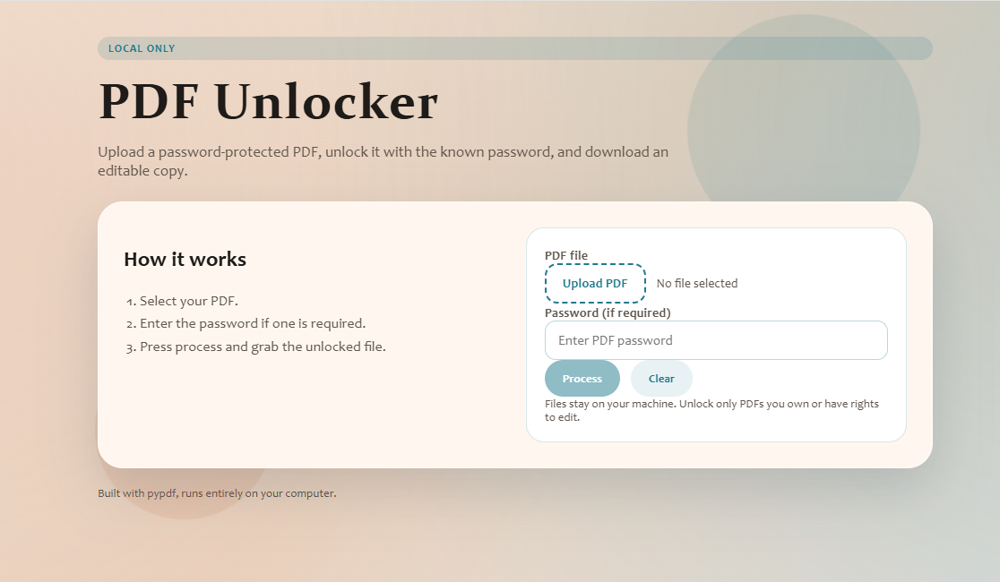

# PDF Unlocker (Local)

Local web app that removes a known password from a PDF so you can edit it.
Built with Flask and pypdf. Files never leave your machine.

本地运行的网页应用，用已知密码解锁 PDF，方便编辑。
基于 Flask 和 pypdf，文件不会上传到第三方。

## Problem solved / 解决的问题
- Many PDFs are protected with an owner password that blocks editing.
- This tool unlocks a PDF using the password you already know.
- No uploads to third party services.

- 很多 PDF 有“所有者密码”，导致无法编辑。
- 本工具使用你已知的密码进行解锁。
- 全程本地处理，不上传第三方。

## Features / 功能
- Local only processing
- Upload and process UI
- Download unlocked PDF
- Works with encrypted and unencrypted PDFs

- 本地处理
- 上传并处理的界面
- 下载已解锁的 PDF
- 支持已加密与未加密的 PDF

## Screenshot (Safari on Windows) / 截图（Windows Safari）

## Quick start / 快速开始
1. `python -m venv .venv`
2. `.venv\\Scripts\\activate`
3. `pip install -r requirements.txt`
4. `python app.py`
5. Open `http://127.0.0.1:5000`

## Usage / 使用方法
1. Click "Upload PDF" and choose a file.
2. Enter the password if the PDF is encrypted.
3. Press "Process".
4. Download the unlocked copy.

1. 点击 "Upload PDF" 选择文件。
2. 如果 PDF 加密，输入密码。
3. 点击 "Process"。
4. 下载解锁后的 PDF。

## Notes / 注意事项
- You must know the password. This does not break encryption.
- Unlocked copies are written to `output/` and offered as downloads.
- Max upload size is 50 MB (adjust `MAX_MB` in `app.py`).

- 必须知道密码，本工具不会破解加密。
- 解锁后的文件会写入 `output/` 并提供下载。
- 最大上传 50 MB（可在 `app.py` 中调整 `MAX_MB`）。

https://app.eraser.io/workspace/cn6mFs3Fi24HqiqFIpNi?origin=share
