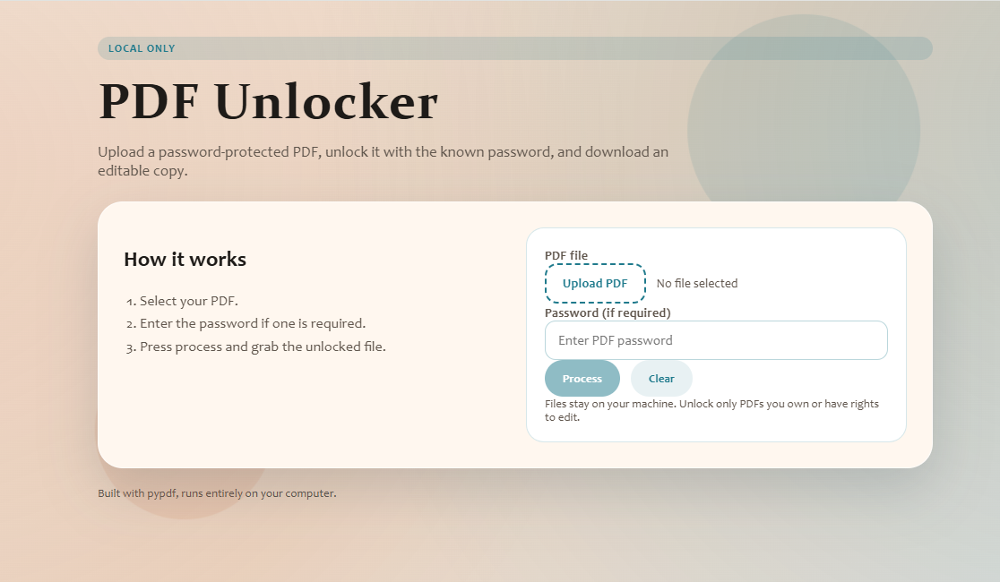

<p align="center">
  <strong>PDF Unlocker</strong>
</p>

<p align="center">
  Remove a known password from a PDF so you can edit it — local-first, or one click on the web.<br>
  用已知密码解锁 PDF，方便编辑 —— 本地优先，也可一键在线使用。
</p>

<p align="center">
  
  
  
  
  
</p>

<p align="center">
  <a href="#english"><b>English</b></a>
  &nbsp;|&nbsp;
  <a href="#中文"><b>中文</b></a>
</p>

<p align="center">
  <a href="https://pdf-pwd.myboringtools.top"><b>🔓 Live demo / 在线体验</b></a>
</p>



<a id="english"></a>

## 🇬🇧 English

### What it does / Why

Many PDFs carry an owner password that blocks editing, printing, copying, or form changes even when the document can be opened. PDF Unlocker removes those restrictions using a password you already know, then returns an unlocked copy that is easier to edit.

This is not a password cracker. It does not guess, brute-force, bypass, or recover unknown passwords. If the PDF requires a password, you must provide the correct one.

The app is local-first. When you run it yourself, files stay on your machine. The hosted version processes each upload in memory for a single request and stores nothing after the response is sent.

### ✨ Features

- In-memory, single-request unlock flow with no files stored by the app.
- Preserves form fields, outlines, and metadata where the PDF structure allows it.
- Works with encrypted PDFs and unencrypted PDFs.
- Friendly error messages for missing files, invalid PDFs, wrong passwords, and file-size limits.
- Clean responsive UI with reduced-motion support.
- Deployable to Vercel or runnable locally with Flask.

### 🚀 Live demo

Primary demo:

[https://pdf-pwd.myboringtools.top](https://pdf-pwd.myboringtools.top)

Alternate Vercel URL:

[https://pdf-pwd-eight.vercel.app](https://pdf-pwd-eight.vercel.app)

The Vercel URL is live now; the custom domain activates once DNS finishes propagating.

### 🖥️ Run locally

Use Windows PowerShell:

```powershell
git clone https://github.com/hanco1/pdf_pwd.git
cd pdf_pwd
python -m venv .venv
.\.venv\Scripts\Activate.ps1
pip install -r requirements.txt
python app.py
```

Then open:

```text
http://127.0.0.1:5000
```

The local upload limit defaults to 4 MB. Raise it with the `MAX_MB` environment variable:

```powershell
$env:MAX_MB = "20"
python app.py
```

### ☁️ Deploy your own to Vercel

The project is ready for Vercel's Python runtime:

```text
api/index.py       exposes the Flask app
vercel.json        rewrites all routes to api/index.py
requirements.txt   triggers dependency installation for the Python runtime
```

Deploy flow:

1. Push this repository to GitHub.
2. Import the repository on [vercel.com](https://vercel.com), or deploy with the `vercel` CLI.
3. Keep the default build settings and deploy.

Vercel's hosted request-body limit is about 4.5 MB, so larger PDFs should be unlocked locally with a higher `MAX_MB` value.

### 📖 Usage

1. Choose a PDF file.
2. Enter the password if the PDF requires one.
3. Press **Process**.
4. Download the unlocked PDF when processing completes.

### 🔒 Security & limits

- You must know the password. PDF Unlocker is not a cracker and does not recover unknown passwords.
- The hosted version is stateless and in-memory; it stores no uploaded PDFs or unlocked outputs.
- The hosted deployment is limited by Vercel's request-body size, roughly 4.5 MB.
- For sensitive documents or larger files, run the app locally so the PDF never leaves your machine.

### 🛠️ Tech stack

- Flask
- pypdf
- Vanilla HTML/CSS/JS in a single-file app
- Vercel Python serverless runtime

### 📄 License

MIT.

<p align="center"><a href="#english">English</a> | <a href="#中文">中文</a></p>

<a id="中文"></a>

## 🇨🇳 中文

### 它能做什么 / 为什么需要

很多 PDF 带有“所有者密码”，会限制编辑、打印、复制或表单修改，即使文件本身可以打开也无法顺利编辑。PDF Unlocker 使用你已经知道的密码移除这些限制，并返回一份便于编辑的解锁副本。

它不是密码破解工具。它不会猜测、暴力破解、绕过或找回未知密码。如果 PDF 需要密码，你必须输入正确密码。

这个项目本地优先。自行运行时，文件不会离开你的电脑。托管版本会在每次请求中以内存方式处理上传文件，响应结束后不保存任何文件。

### ✨ 功能

- 单次请求内存解锁流程，应用不存储任何文件。
- 在 PDF 结构允许的情况下保留表单字段、书签大纲和元数据。
- 支持已加密和未加密 PDF。
- 对缺少文件、无效 PDF、密码错误、文件大小超限等情况提供友好的错误提示。
- 干净的响应式界面，并支持减少动态效果偏好。
- 可部署到 Vercel，也可用 Flask 在本地运行。

### 🚀 在线体验

主链接：

[https://pdf-pwd.myboringtools.top](https://pdf-pwd.myboringtools.top)

备用 Vercel 链接：

[https://pdf-pwd-eight.vercel.app](https://pdf-pwd-eight.vercel.app)

Vercel 链接已可访问；自定义域名在 DNS 生效后启用。

### 🖥️ 本地运行

使用 Windows PowerShell：

```powershell
git clone https://github.com/hanco1/pdf_pwd.git
cd pdf_pwd
python -m venv .venv
.\.venv\Scripts\Activate.ps1
pip install -r requirements.txt
python app.py
```

然后打开：

```text
http://127.0.0.1:5000
```

本地上传大小默认限制为 4 MB。可以通过 `MAX_MB` 环境变量调高：

```powershell
$env:MAX_MB = "20"
python app.py
```

### ☁️ 部署到你自己的 Vercel

项目已按 Vercel Python Runtime 的方式组织：

```text
api/index.py       暴露 Flask app
vercel.json        将所有路径重写到 api/index.py
requirements.txt   触发 Python Runtime 安装依赖
```

部署步骤：

1. 将仓库推送到 GitHub。
2. 在 [vercel.com](https://vercel.com) 导入仓库，或使用 `vercel` CLI 部署。
3. 保持默认构建设置并部署。

Vercel 托管环境的请求体大小限制约为 4.5 MB，因此更大的 PDF 建议在本地解锁，并按需调高 `MAX_MB`。

### 📖 使用方法

1. 选择 PDF 文件。
2. 如果 PDF 需要密码，输入对应密码。
3. 点击 **Process**。
4. 处理完成后下载解锁后的 PDF。

### 🔒 安全与限制

- 你必须知道密码。PDF Unlocker 不是破解工具，也不会找回未知密码。
- 托管版本无状态、以内存方式处理文件；不会保存上传的 PDF 或解锁结果。
- 托管部署受 Vercel 请求体大小限制影响，约为 4.5 MB。
- 对于敏感文件或大文件，建议在本地运行，确保 PDF 不离开你的电脑。

### 🛠️ 技术栈

- Flask
- pypdf
- 原生 HTML/CSS/JS，单文件应用结构
- Vercel Python Serverless Runtime

### 📄 许可证

MIT。

<p align="center"><a href="#english">English</a> | <a href="#中文">中文</a></p>
